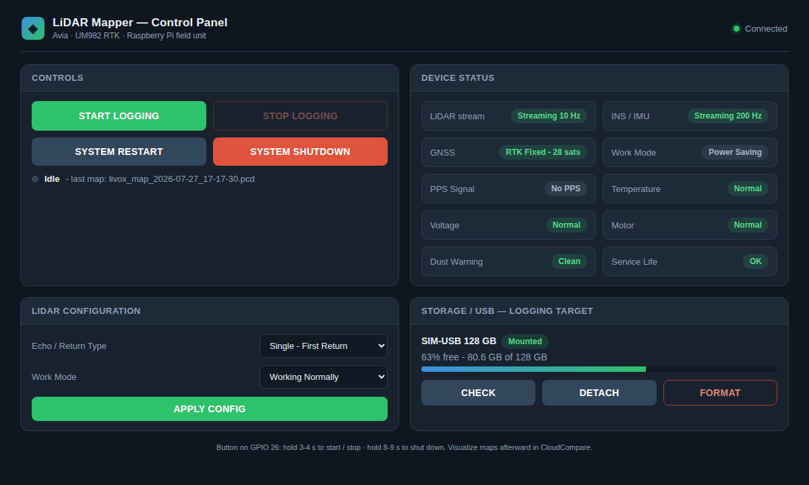

# mapper_web - field control dashboard

Run the Livox high-precision mapper from a phone or laptop - no terminals, no
SSH. A small web dashboard on the Pi plus a physical pushbutton on GPIO 26.



## What it does

- **Start / Stop logging** - one action, from the web page or the GPIO button.
  Start spins the laser head up out of power-saving, runs data checks, then
  records to the USB stick. Stop saves the `.pcd` (+ `.geo.txt`), spins the head
  back down, and safely ejects the USB.
- **GPIO 26 pushbutton** - hold **3-4 s** to start/stop, hold **8-9 s** to shut
  the Pi down. An **RGB status LED** (default GPIO 16/20/21 = R/G/B) shows state
  at a glance: solid green = idle & ready, solid red = not ready (no USB), blink
  yellow = spinning up / stopping, blink blue = recording, double green = button
  logging-armed, double red = shutdown-armed.
- **Live status** - LiDAR / IMU streaming rates, GNSS fix + sats, and the LiDAR
  device indicators (work mode, PPS, temperature, voltage, motor, dust, service
  life).
- **LiDAR config** - echo/return type and work mode, applied to the device.
- **USB storage** - mount state, free space, safe detach, format. Logs always
  go to USB, never the Pi's SD card.

Visualise the maps afterwards in CloudCompare (colour by height / depth /
reflectivity, point size) - that data is all inside the `.pcd`.

## Build

```bash
cd ~/ws          # your colcon workspace (this repo)
colcon build --packages-select mapper_web
source install/setup.bash
```

Optional, for the GPIO button + LED on the Pi:

```bash
sudo apt install python3-gpiozero
```

(No Flask/FastAPI needed - the server is pure Python standard library.)

## Run

```bash
# Start the Livox LiDAR driver and the sensors bringup as usual, then:
ros2 launch mapper_web dashboard.launch.py
```

Open `http://<pi-ip>:8080` from any device on the same network.

Useful launch args:

| arg | default | meaning |
|-----|---------|---------|
| `port` | `8080` | web port |
| `mount_point` | `/media/log` | USB logging target |
| `button_gpio` | `26` | pushbutton pin |
| `led_red` / `led_green` / `led_blue` | `16` / `20` / `21` | RGB status LED pins |
| `on_fail` | `wait` | `wait` = retry checks, `abort` = cancel start if a sensor isn't ready |
| `simulate` | `false` | run with no ROS2/GPIO/USB (dev + demo) |

## Try it without hardware

```bash
python3 -m mapper_web.server --simulate --port 8080
```

Everything works against simulated sensors and a virtual USB - handy for a demo
or for developing the UI.

## Run at boot (systemd)

See `mapper_web.service` in this folder - installs the dashboard as a service so
it comes up with the Pi.
